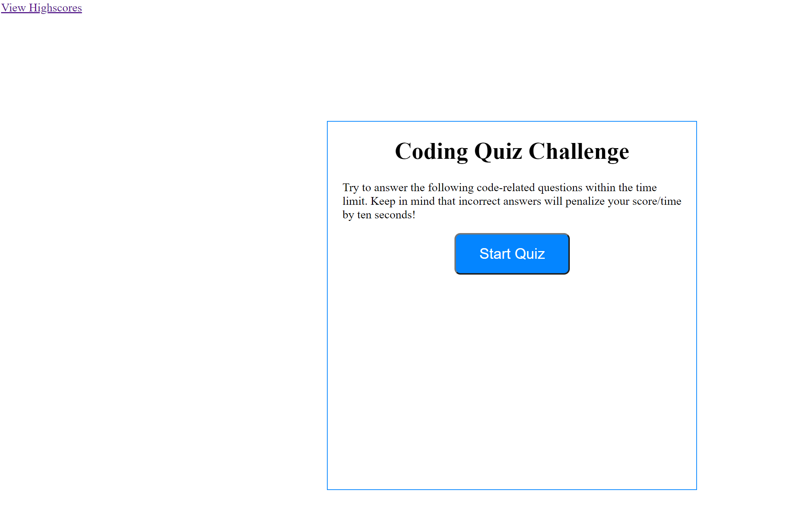

# Code-Quiz:

This is an HTML, CSS, and Javascript quiz application. This application stresses the use of Javascript to give quiz questions and gather user data to evaluate if the answers to a question are right, after which a score is generated and a final page of results from the user data is appended.
