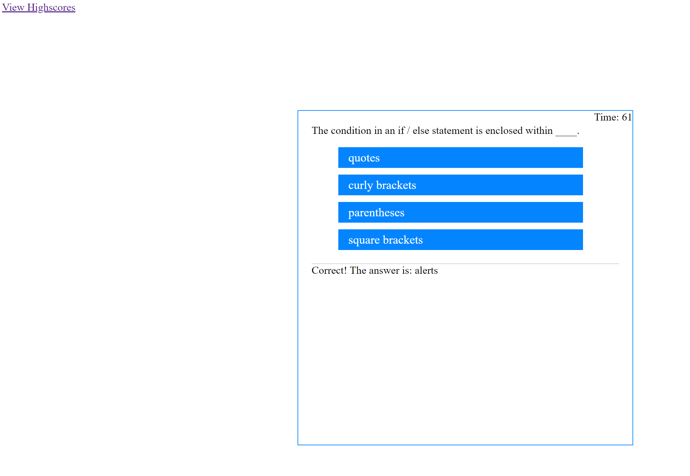
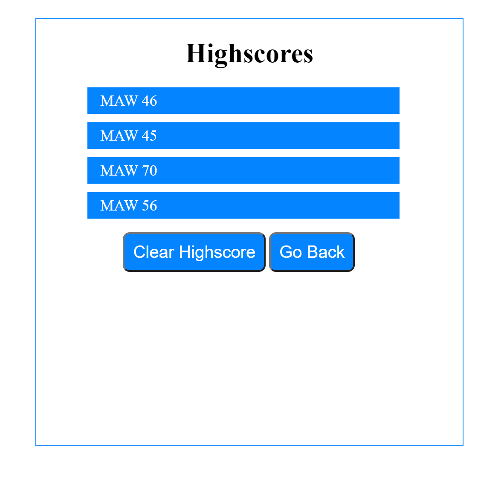

# Code-Quiz:

### This is an HTML, CSS, and Javascript quiz application. This application stresses the use of Javascript to give quiz questions and gather user data to evaluate if the answers to a question are correct, after which a score is generated and a final page of results from the user data is appended.

>Application contains two html files, (1 for questions, another for a connecting display page to highscores) two javascript files (questions & highscores), and a CSS stylesheet for all files mentioned previously
